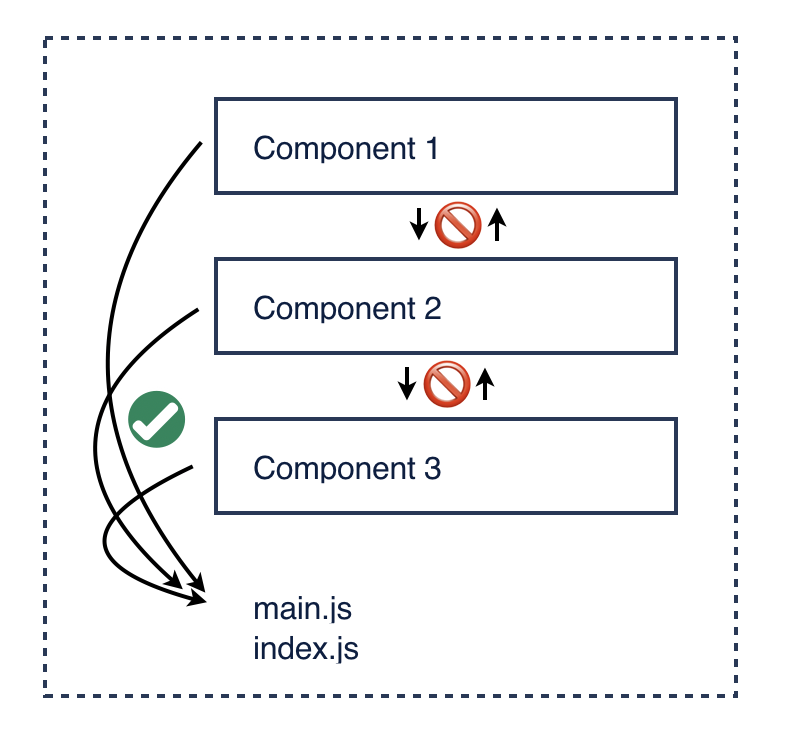

# UI composition

When everything is a component and there is no external state management solution on top of them, it
is more important than ever to provide simple, clear and concise guidelines on how the code should
be composed and structured, to make it easy to navigate and reason about, especially in bigger apps.

The most important part of the app is UI. The structure of UI folder in tangerine follows a strict
hierarchical model.

At the root of the UI folder there should be `main.js` and `index.js` files of a “root” component,
that serve as an entry and compose the logic together. At the same level there can be other
components that this “entry” consumes. All those components should be completely isolated from each
other, should have clearly defined API and should not have any knowledge about their neighbours.
Only the main.js file on the same level can import those components and compose them together.



Every component follows the same structure: it has main.js with the core logic of the component,
index.js to re-export public API of that component, and it can have “children” components that are
consumed by the “main” component on that level of hierarch only.


That way it is always clear, on every level hierarchy, what is composed from what and how everything
is structured. Furthermore, structure like this excludes all possibilities of any circular
dependencies and re-enforces and visualizes the idea of top-down data flow.

## Common components

When a component needs to be re-used across different components in the hierarchy, it should be
moved into the root common folder, where it should follow exactly the same architecture as all other
UI components have.

In the past we were encouraging developers to put shareable components on the minimal branch level
of the hierarchy. Unfortunately, this approach lead to very little discoverability of components in
those common folders and low code re-use. Because of that, tangerine spec encourages to have only
one common folder at the root level of the package, as the single source of truth for re-usable
components in a package.

## Deep nested hierarchy

In the past we were encouraging very deep nested views as a way to structure view folder, and was
heavily taking advantage of Redux to avoid props drilling.

In tangerine, in the absence of Redux, in order to lessen the impact of the props drilling problem,
the deep hierarchical structure naturally flattens into logical components with clear boundaries and
API, rather than literally describing the UI on the screen.

Consider, for example, a feedback dialog with the following logical structure


The way we would implement it in a "tangerine-compliant" way would be to isolate “meaningful”
components and flatten the hierarchy. With that in mind, the recommended way to structure this app
would be either this:

```javascript
/ui
  /dialog
    /emotion-selector
    /reason-selector
    /feedback-input
    /allow-contact-switch
  /success-flag
```

or maybe even this, where all those components are composed in the main.js file of the app:

```javascript
/ui
  /emotion-selector
  /reason-selector
  /feedback-input
  /allow-contact-switch
  /success-flag
```

That depends only on complexity of the logic that said dialog incorporates and whether there can be
clear boundaries between components that make sense in isolation. In case of the feedback dialog
example, there are clear boundaries that can be extracted: modal dialog with everything within, and
success flag, which sits outside of the logic of the actual modal. That being said, although the
second code example technically do not violate any formal rules, the **first code example** would be
“blessed” and **recommended** way to structure feedback-dialog app in a tangerine-compliant way.

-----

## Related reading

[State management: core concepts](../../state-management)
[Everything is a component](../../everything-is-a-component.md)
[Writing examples for UI components](examples.md)
[Using dependency injections](../../dependency-injection.md)
